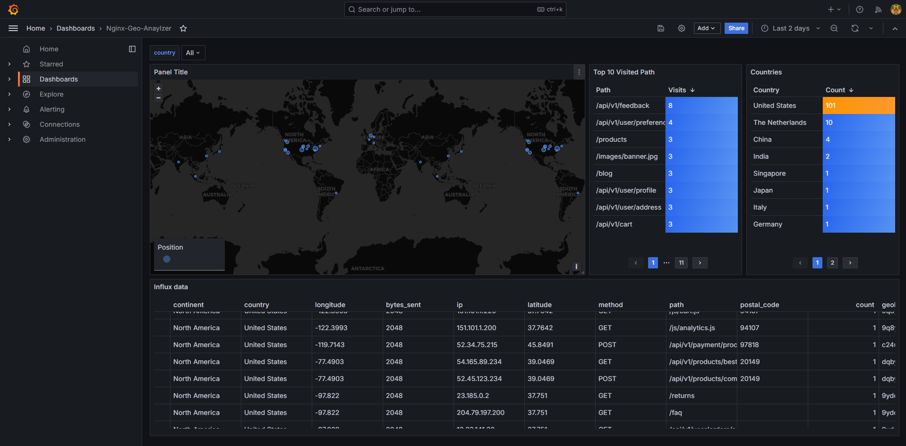
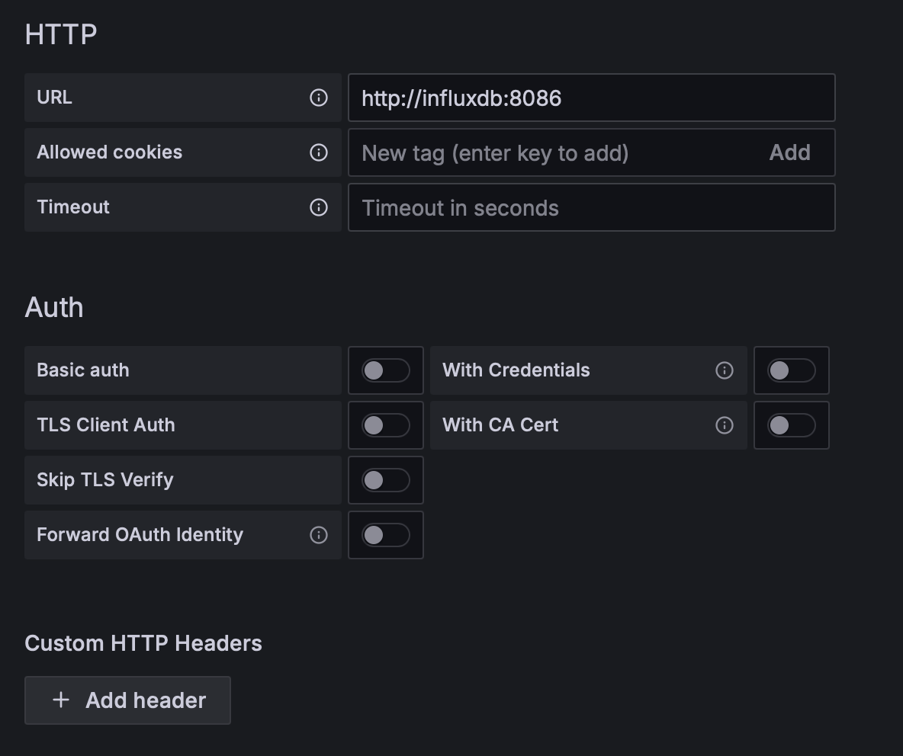
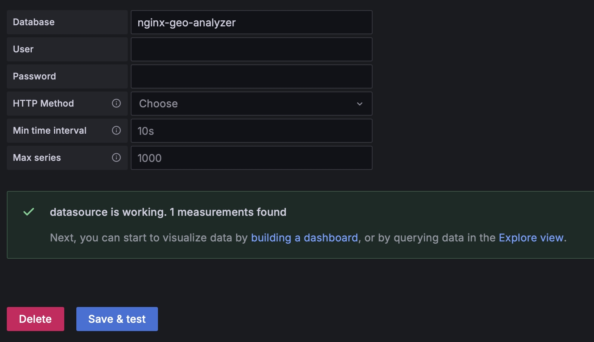

# nginx-geo-analyzer

A non-intrusive Nginx log analyzer with geographical insights.



## Overview

This project provides a solution for analyzing Nginx access logs with geographical information without requiring modifications to your Nginx configuration. It draws inspiration from [geoip2influx](https://github.com/GilbN/geoip2influx) for dashboard design but offers a key advantage: it doesn't require the installation of additional Nginx modules like [ngx_http_geoip2_module](https://github.com/leev/ngx_http_geoip2_module). 

Additionally, we provide an example Grafana dashboard. Of course, you can design or modify the dashboard yourself - you just need to add InfluxDB as a data source.

## Key Features

- Analyzes standard Nginx access logs without any modifications to Nginx
- Provides geographical insights based on IP addresses in the logs
- Stores analyzed data in InfluxDB for easy visualization
- Compatible with existing Nginx setups
- Example Grafana dashboard included

## Option 1: Use Docker Compose

If you don't have InfluxDB and Grafana, you can use Docker Compose to start them automatically.

### Prerequisites

- Docker and Docker Compose
- Nginx with default access log format, for example:
```
access_log  /var/log/nginx/access.log;
```
- GeoLite2-City.mmdb, provided by [MaxMind](https://www.maxmind.com/en/geolite2/signup).

### Configure Docker Compose

Edit the `docker-compose.yml` file to match your environment. You need to map the Nginx log file and the GeoLite2-City.mmdb file to the container. For example, assuming you place the GeoLite2-City.mmdb file in the `geodb` directory and your Nginx log file is in `/var/log/nginx/website1`, you can modify the `docker-compose.yml` file like this:

```
volumes:
      - ./geodb:/app/geodb
      - /var/log/nginx/website1:/var/log/nginx
```

### Run

```bash
docker compose up
```

### Configure Grafana Datasource

You can now access Grafana at `http://localhost:3000` and configure the InfluxDB datasource. The default username and password for Grafana is `admin`.

Please use `http://influxdb:8086` as the URL and leave the rest of the fields empty.



The database name is `nginx-geo-analyzer`: 



### Configure Grafana Dashboard

Import the `dashboard.json` file in Grafana.

## Option 2: Standalone python

This option applies if you already have InfluxDB and Grafana installed. 

### Prerequisites

- Conda or Python 3.8
- InfluxDB 1.8
- Grafana 11.2.2
- GeoLite2-City.mmdb, provided by [MaxMind](https://www.maxmind.com/en/geolite2/signup). Please place it in the `geodb` directory.
- Nginx with default access log format, for example:

```
access_log  /var/log/nginx/access.log;
```

### Setup environment

If you use Conda, you can create an environment with the provided `environment.yml` file:

```bash
conda env create -f environment.yml
```

Otherwise, you can install the dependencies manually using `pip`:

```bash
pip install -r requirements.txt
```

Edit the `config.yaml` file to match your environment. For example:

```yaml
influx_host: localhost
influx_port: 8086
nginx_log: /var/log/nginx/access.log
influx_username: null
influx_password: null
geoip2_db: ./geodb/GeoLite2-City.mmdb
log_level: INFO
```

- `influx_host`: The hostname or IP address of your InfluxDB server. Default is 'localhost'.
- `influx_port`: The port number on which InfluxDB is running. Default is 8086.
- `nginx_log`: The full path to your Nginx access log file. Default is '/var/log/nginx/access.log'.
- `influx_username`: The username for InfluxDB authentication. Set to null if authentication is not required.
- `influx_password`: The password for InfluxDB authentication. Set to null if authentication is not required.
- `geoip2_db`: The path to your GeoLite2-City.mmdb file. Default is './geodb/GeoLite2-City.mmdb'.
- `log_level`: The logging level for the application. Default is 'INFO'.

### Run

Then you can run the script by:

```bash
python main.py
```

## Grafana dashboard

You can use the [`dashboard.json`](https://github.com/liangrunda/nginx-geo-analyzer/blob/main/grafana/dashboard.json) file to import the dashboard into Grafana. 


## How It Works

nginx-geo-analyzer reads your default Nginx access logs, using a python script processes the IP addresses to obtain geographical information, and stores the results in InfluxDB. The GeoIP2 database is provided by [MaxMind](https://www.maxmind.com/) and it is only needed in the python script (instead of the Nginx module).
